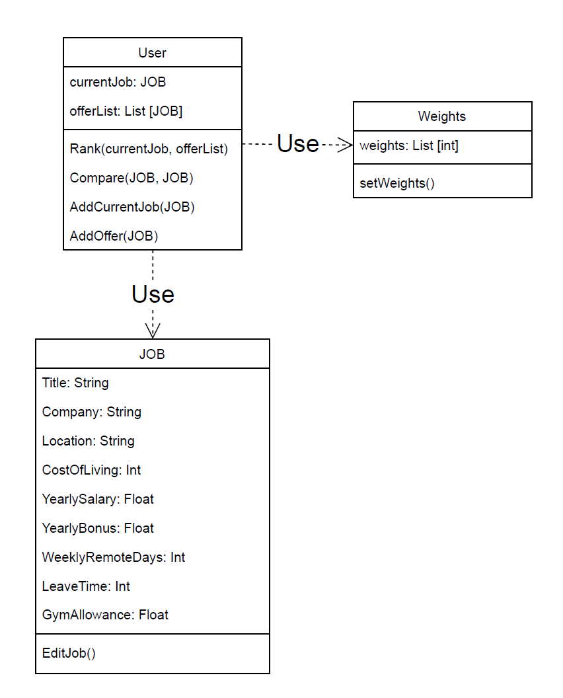
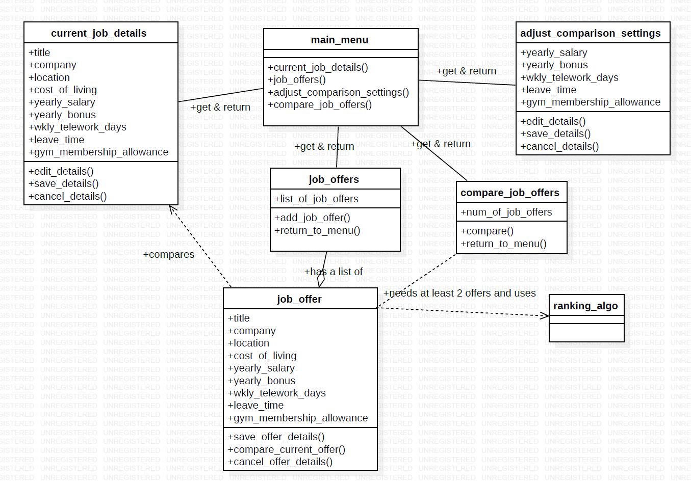
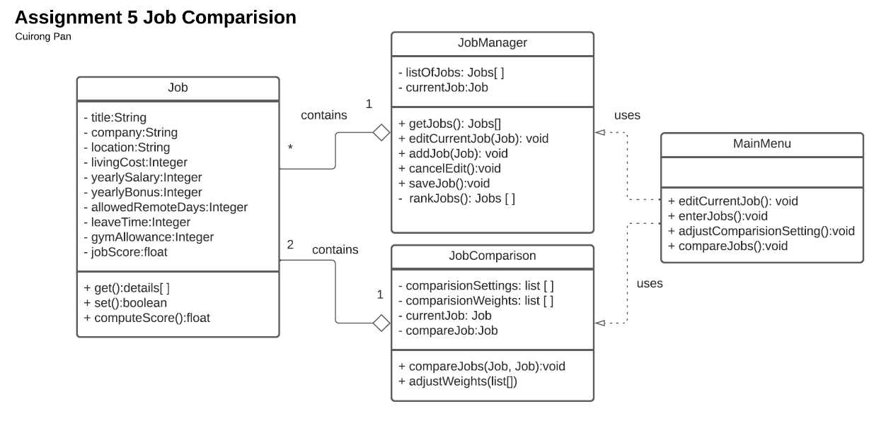
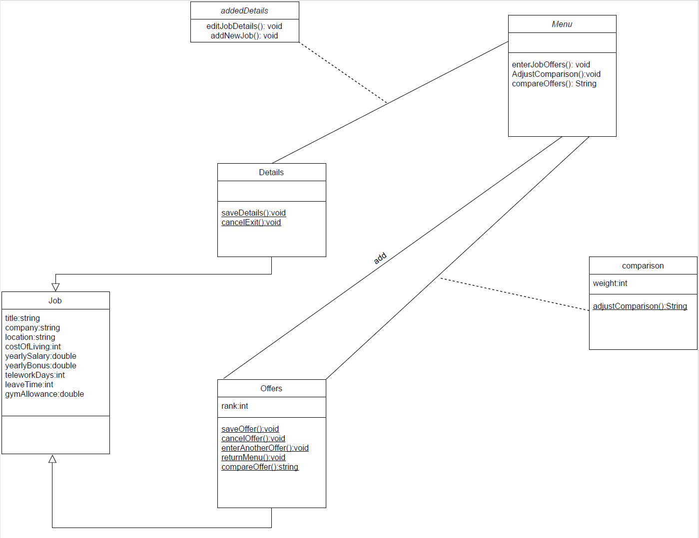
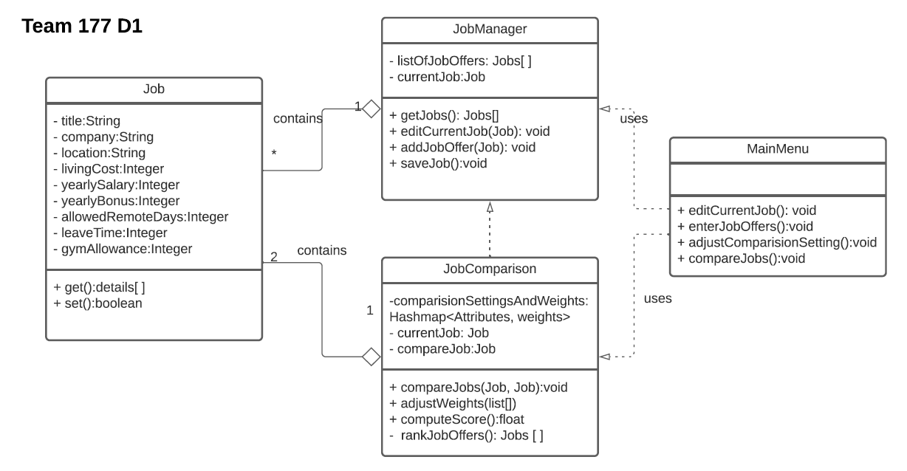

# Design Discussion

## Design 1 
Pros: Has an entry point, has the necessary attributes and methods

Cons: Basic level class diagram, needs additional classes 

 

## Design 2
Pros: Has an entry point, level of detail

Cons: Can consolidate some classes, class naming conventions, did not set correct attribute visibility

 

## Design 3 
Pros: Beautiful design, concise

Cons: Lacks a connection between classes *JobManager* and *JobComparison*  

 

## Design 4
Pros: Has an entry point, clear design

Cons: Lack of detail, lack of attribute visibility indicators, organization of classes between Jobs and addedDetails

 

## Team Design
 

Some of the main commonalities were having the main menu as the entry point, establishing *Job* as its own class, and various attributes needed. We had different views on where certain method/operations should be housed. For our Team Design, we wanted a clear design with a certain level of detail. As a result, we decided to use Design 3 has our base and then add some modifications to it. We changed some methods around that we felt were better in another class or not needed at all. Some examples were:
1. Removing *jobScore* attribute from the *Job* class
2. Relocating *computeScore()* method from the *Job* class to the *JobComparison* class
3. Relocating *rankJob()* method (renamed *rankJobOffers()*) from the *JobManager* class to the *JobComparison* class 

## Summary
Some of the lessons learned were attribute visibility, necessary connections between certain classes, and class dependencies.