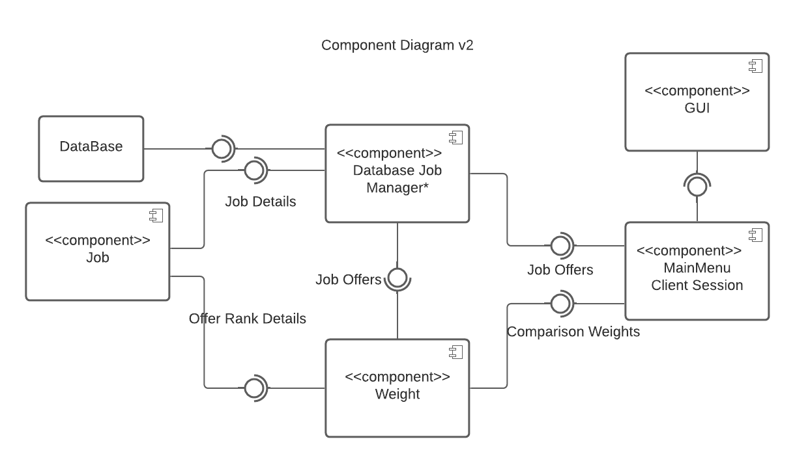
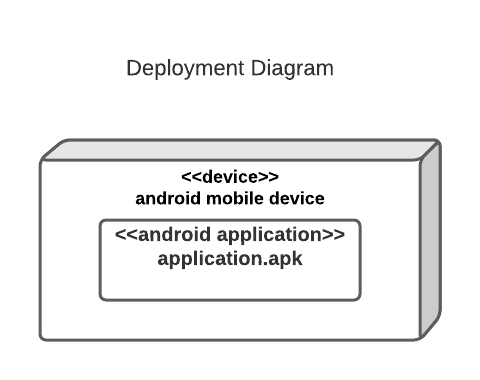
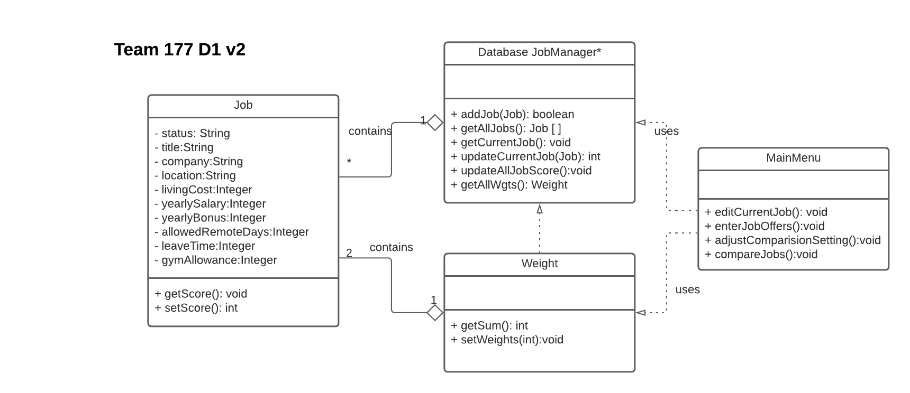
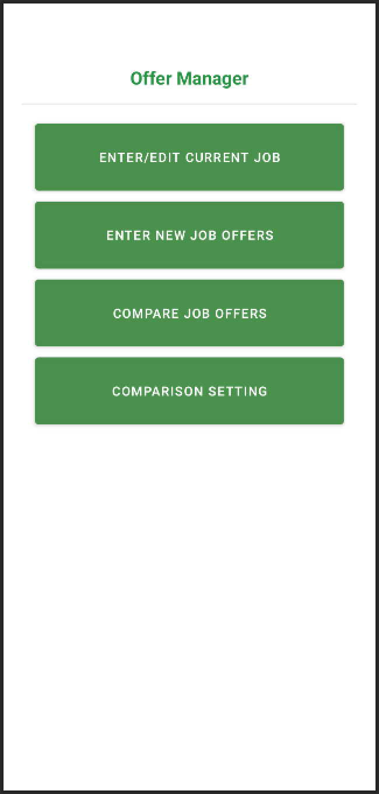
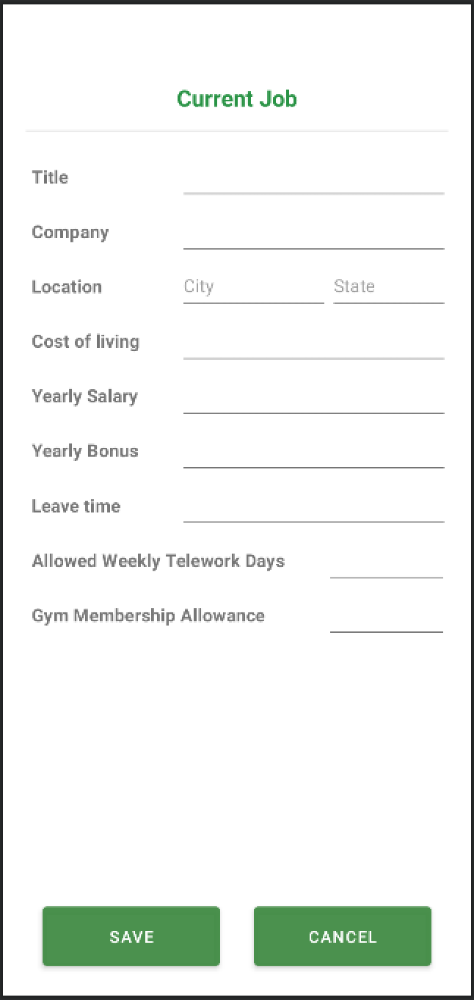
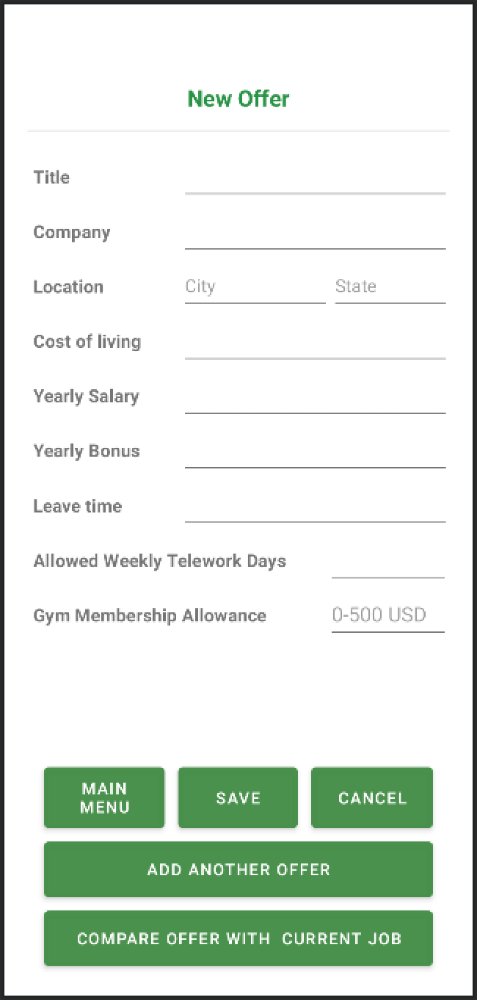
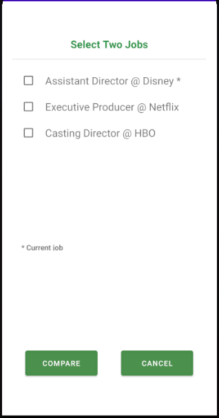
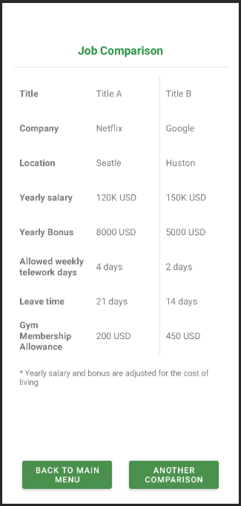

# Design Document

**Author**: Team 177

## Version 2
**Changes**:
-	**Updated Class Diagram**: We changed the name of the class JobManager to Database JobManager (named DatabaseHelper), changed the name of the class JobComparison to Weight. We moved the duties of the JobManager class to the DatabaseHelper class since both classes were doing almost the same thing. We removed variables from Database JobManager and Weight, as all variables are created and handled within respective Activity classes. We relocated some of the duties of the JobComparison to the database, such as computing the score, and the ranking, since it would be faster to do so and less work on the app. Since we removed such duties, we used a Weight class that would handle setting the weights and getting the sum of the weights. In the Job class, we added a ‘status’ variable to track either a job entered is ‘current’ or ‘offer’ since all jobs are stored in the same table. The four methods mentioned in Main Menu are being implemented through the front-end activity classes. 
-	**Updated Component Diagram**: We reflected the changes from the class diagram onto the component diagram. We changed the name of the Job Manager component to Database Job Manager (named DatabaseHelper), changed the name of the Comparison Setting component to Weight, removed Job’s connection to the database, and add a database connection to Database Job Manager. We did not create a class for Comparison Setting but created a Weight class for setting the weights instead. DatabaseHelper has direct access to the database, not the Job class, as we placed all created database-related methods in one class.  
-	**Updated UI Design**: We removed the bold format of the current job and left the asterisk for simplicity. 
-	
## 1 Design Considerations

### 1.1 Assumptions

An important dependency of our software is the way in which the information of the job information and offer is stored.  This means our application must retain the information when the application is forced quit.  we are assuming that the version of android will run on the supported hardware without issue.  In other words, we are not having to worry about supporting multiple versions of the application for different versions of android.  

### 1.2 Constraints

One of the constraints on the system from a design perspective will be the manner in which we display the information to the user.  What if the user has added in 300 job offers, how would we go about handling the selection of the offers to the user.

### 1.3 System Environment

Our application will be running on API 29: Android 10.0(Q).  The hardware that our application will run on will be any hardware that supports at least Android 10.0 and above.

## 2 Architectural Design

The architecture provides the high-level design view of a system and provides a basis for more detailed design work. These subsections describe the top-level components of the system you are building and their relationships.

### 2.1 Component Diagram

Component Diagram simplify the high-level view of the system. It shows the various components and how they are connected.   
In this application, it contains six large components including GUI, MainMenu Client Session, Database Job Manager (DatabaseHelper), Weight, Job and Database.  
GUI is the component of the system entry interface. Users operate through the interface. GUI requires the information through Main Menu client session about main functions.  
Main Menu contains the functions on the main page, it requires interface from Database Job Manager for Job offers and Weight for weights.  
Database Job Manager, Weight and Job are interacted to calculate the score and rank the job offers.  
All data are stored in local database.

### 2.2 Deployment Diagram

The deployment diagram for this app is really simple because the deployments are  handled within an andrioid device.

## 3 Low-Level Design

### 3.1 Class Diagram

 

## 4 User Interface Design

    

    

