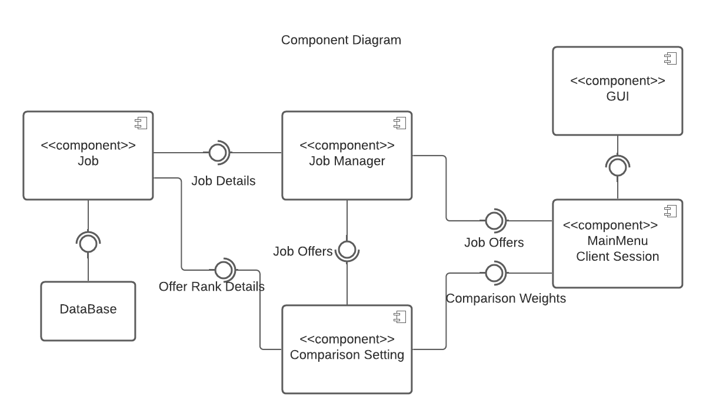
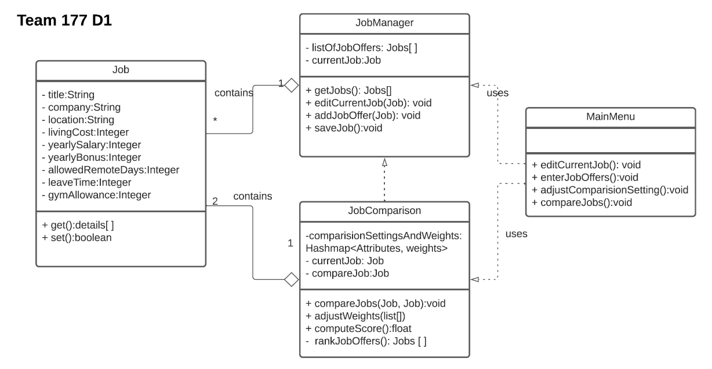
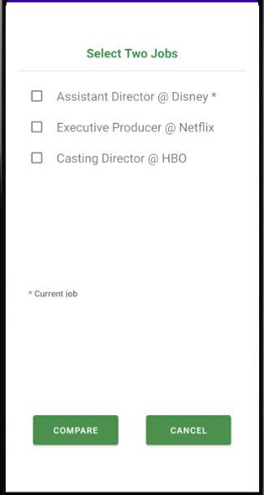
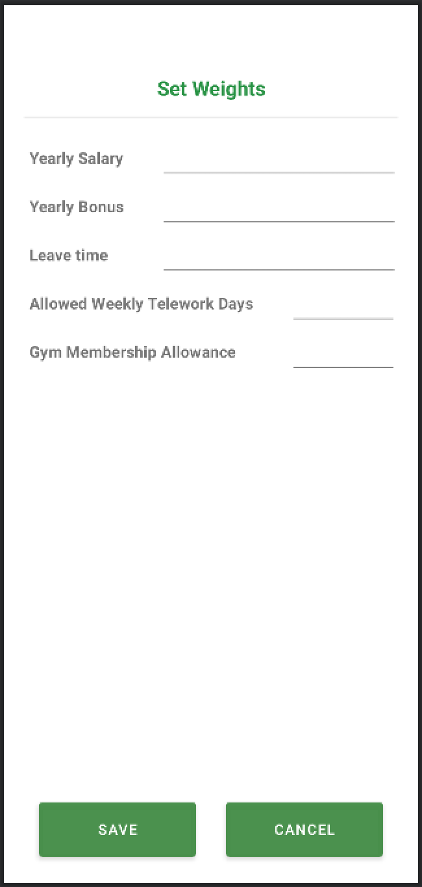

# Design Document

**Author**: Team 177

## 1 Design Considerations

*The subsections below describe the issues that need to be addressed or resolved prior to or while completing the design, as well as issues that may influence the design process.*

### 1.1 Assumptions

*Describe any assumption, background, or dependencies of the software, its use, the operational environment, or significant project issues.*

An important dependency of our software is the way in which the information of the job information and offer is stored.  This means our application must retain the information when the application is forced quit.  we are assuming that the version of android will run on the supported hardware without issue.  In other words, we are not having to worry about supporting multiple versions of the application for different versions of android.  

### 1.2 Constraints

*Describe any constraints on the system that have a significant impact on the design of the system.*

One of the constraints on the system from a design perspective will be the manner in which we display the information to the user.  What if the user has added in 300 job offers, how would we go about handling the selection of the offers to the user.

### 1.3 System Environment

*Describe the hardware and software that the system must operate in and interact with.*

Our application will be running on API 29: Android 10.0(Q).  The hardware that our application will run on will be any hardware that supports at least Android 10.0 and above.

## 2 Architectural Design

The architecture provides the high-level design view of a system and provides a basis for more detailed design work. These subsections describe the top-level components of the system you are building and their relationships.

### 2.1 Component Diagram

Component Diagram simplify the high-level view of the system. It shows the various components and how they are connected.   
In this application, it contains six large components including GUI, MainMenu Client Session, Job Manager, Comparison Setting, Job and Database.  
GUI is the component of the system entry interface. Users operate through the interface. GUI requires the information through Main Menu client session about main functions.  
Main Menu contains the functions on the main page, it requires interface from Job Manager for Job offers and Comparison Setting for weights.  
Job Manager, Comparison Setting and Job are interacted to calculate the score and rank the job offers.  
All data are stored in local database.

### 2.2 Deployment Diagram

The deployment diagram for this app is really simple because the deployments are  handled within an andrioid device.

## 3 Low-Level Design

*Describe the low-level design for each of the system components identified in the previous section. For each component, you should provide details in the following UML diagrams to show its internal structure.*

### 3.1 Class Diagram

*In the case of an OO design, the internal structure of a software component would typically be expressed as a UML class diagram that represents the static class structure for the component and their relationships.*

 

### 3.2 Other Diagrams

*<u>Optionally</u>, you can decide to describe some dynamic aspects of your system using one or more behavioral diagrams, such as sequence and state diagrams.*

## 4 User Interface Design
*For GUI-based systems, this section should provide the specific format/layout of the user interface of the system (e.g., in the form of graphical mockups).*

    

    

