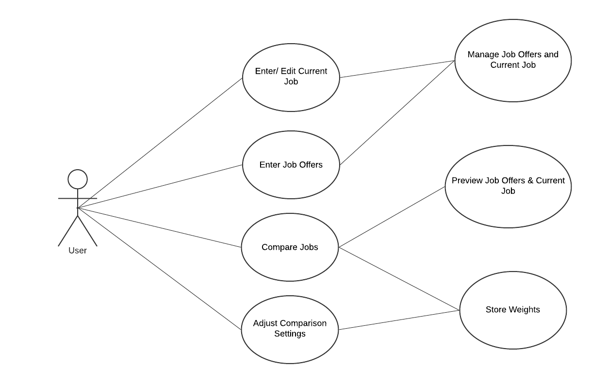

# Use Case Model

**Author**: Team 177

## 1 Use Case Diagram

 

## 2 Use Case Descriptions

### Use Case #1
- **Requirements:** Enter/Edit Current Job
- **Pre-conditions:** No pre-conditions; User has permission to use this feature
- **Post-conditions:** Current Job information can be left as null, stored, or updated
- **Scenarios:** 

### Use Case #2
- **Requirements:** Enter New Job Offers
- **Pre-conditions:** No pre-conditions; User has permission to use this feature
- **Post-conditions:** Job Offer information can be left as null or stored.
- **Scenarios:** 
1. User press ‘Enter Job Offers’ button from Main Menu
2. User is taken to the ‘New Offer’ window (blank) to enter information
3. User press ‘save’ button to store the information, ‘cancel’ button without saving and return to menu, or press ‘main menu’ button to return to menu.
    
    *OPTIONAL*
4. a. If multiple offers to enter, User can press ‘Add Another Offer’ button AFTER pressing ‘save’ button.

    b. User taken to the another ‘New Offer’ window (blank) to enter information.

    c. User press ‘save’ button to store the information, ‘cancel’ button without saving and return to menu, or press ‘main menu’ button to return to menu.

    *OPTIONAL*
5. a. If to compare, User press ‘Compare Offer with Current Job’ button (if Current job info is enteredmust be present*).

    b. User is taken to the ‘Job Comparison’ window to see side by side comparison between Current Job and recently saved Job Offer information.

    c. User press ‘Back to Main Menu’ button to return to menu.

### Use Case #3
- **Requirements:** Compare Job Offers
- **Pre-conditions:** Must have either (1) at least two job offers, in case there is no current job, or (2) at least one job offer, in case there is a current job.
- **Post-conditions:** A ranking list consists of Job Offers and, if present, the Current Job.
- **Scenarios:** 
1. User press Compare Job Offers’ button from Main Menu
2. User is taken to the ‘Select Two Jobs’ window where shown a list of job offers & current job ranked (based on algorithm and weights) from best to worst. 
3. If to compare, User selects two jobs and press ‘Compare’ button, or press ‘cancel’ button to return to menu.
4. If ‘compare’ button is pressed, taken to a to the ‘Job Comparison’ window to see side by side comparison between Current Job and recently saved Job Offer information.
5. User press ‘Back to Main Menu’ button to return to menu or press ‘Another Comparison’ button to do another comparison

    *OPTIONAL*

6. If User want to do another comparison, press ‘Another Comparison’ button that will return back to the ‘Select Two Jobs’ window to select two jobs again.

### Use Case #4
- **Requirements:** Adjust Comparison Settings
- **Pre-conditions:** No pre-conditions; User has permission to use this feature
- **Post-conditions:** Weights are stored. If null, weights are assigned accordingly. 
- **Scenarios:** 
1. User press ‘Comparison Settings’ button from Main Menu
2. User is taken to the ‘Set Weights’ window (blank) to enter information
3. User press ‘save’ button to store the information and return to menu, or ‘cancel’ button without saving and return to menu
